# Autonomous E2E Test Engineering Framework

An autonomous, multi-agent end-to-end test automation framework built with **Playwright**, **TypeScript**, and **Agentic Architecture** (Antigravity CLI / Copilot CLI). 

The platform autonomously crawls target web applications, extracts rich semantic DOM inventories, enforces complete form field population, synthesizes comprehensive test plans (Positive, Negative, and Edge scenarios), and generates runnable, production-grade Playwright TypeScript test suites using the Page Object Model (POM) pattern.

---

## Architecture Overview

```mermaid
flowchart LR
    A["Target Web App (Any URL)"] -->|Crawler / Agent| B["Inspection Layer (playwright-cli-agent)"]
    B -->|Produces IR 1| C[("app-inventory.json")]
    C -->|Decomposes Features| D["Test Strategy Layer (planner-agent)"]
    D -->|Produces IR 2| E[("TEST_PLAN.md")]
    E -->|Scaffolds POM & Specs| F["Script Synthesis Layer (ts-testscript-creator)"]
    F -->|Executes & Validates| G["Playwright Test Suite (./tests)"]
```



The framework decouples **Discovery**, **Strategy**, and **Code Synthesis** using strict **Intermediate Representation (IR)** contracts:

1. **Discovery Contract (`app-inventory.json`)**: Machine-readable inventory of modules, routes, form fields, default values, dropdown options, and DOM validation error selectors.
2. **Strategy Contract (`TEST_PLAN.md`)**: Human-auditable, machine-parseable test specifications covering 100% of discovered application features.
3. **Execution Suite (`./tests/`)**: Fully typed, runnable Playwright TypeScript specifications backed by Page Object Models.

---

## Repository Structure

```
gemini_stitch/
├── .agents/                               # Subagent definitions & skills
│   ├── agents/
│   │   ├── playwright-cli-agent/          # Crawler & DOM Inspector Agent definition
│   │   │   └── agent.md
│   │   ├── planner-agent/                 # Test Strategy & Planner Agent definition
│   │   │   └── agent.md
│   │   └── ts-testscript-creator/         # TypeScript Playwright Creator Agent definition
│   │       └── agent.md
│   └── skills/
│       └── playwright-cli/                # Playwright-CLI skill documentation & references
│           ├── SKILL.md
│           └── references/
├── artifacts/                             # Persistent pipeline deliverables
│   ├── inventory/                         # Deep DOM inventories & object maps
│   │   └── app-inventory.json             # 15-module application inventory (405 KB)
│   └── test-plans/                        # Master QA test plans
│       └── TEST_PLAN.md                   # 103 test cases across 15 modules with coverage matrix
├── scripts/                               # Reusable pipeline tools & runners
│   ├── crawler/                           # Headless application crawler
│   │   ├── playwright-crawler.js          # CLI crawler runner
│   │   └── playwright-dom-extractor.js    # In-browser DOM extraction & form filler
│   ├── inspector/                         # In-session interactive step runner
│   │   └── playwright-cli-step.js         # Playwright-CLI run-code step inspector
│   └── planner/                           # Planner analysis & test plan generator tools
│       ├── generate_test_plan.py          # Unified test plan markdown compiler
│       ├── test_plan_data.json            # Structured dataset of all 103 test cases
│       ├── extract_full_module_catalog.py # Lightweight catalog extractor
│       └── catalog_extracted.json         # Extracted module and form summary
├── tests/                                 # Playwright TypeScript Automated Test Suite
│   ├── fixtures/                          # Test fixtures & test data
│   │   ├── test-data.ts                   # Users, accounts, payee data, dynamic generators
│   │   └── test-fixtures.ts               # Custom Playwright test fixture with typed POMs
│   ├── pages/                             # Page Object Models extending BasePage
│   │   ├── BasePage.ts
│   │   ├── LoginPage.ts
│   │   ├── AccountsOverviewPage.ts
│   │   ├── OpenAccountPage.ts
│   │   ├── TransferFundsPage.ts
│   │   ├── BillPayPage.ts
│   │   ├── FindTransactionsPage.ts
│   │   ├── UpdateProfilePage.ts
│   │   ├── RequestLoanPage.ts
│   │   ├── RegistrationPage.ts
│   │   ├── CustomerLookupPage.ts
│   │   ├── CustomerSupportPage.ts
│   │   ├── AdminPage.ts
│   │   └── StaticContentPage.ts
│   └── specs (15 Modules, 103 Test Cases):
│       ├── 01-authentication.spec.ts      # TC-AUTH-001 to 008 (8 tests)
│       ├── 02-accounts-overview.spec.ts   # TC-ACCT-001 to 005 (5 tests)
│       ├── 03-open-new-account.spec.ts    # TC-OPEN-001 to 006 (6 tests)
│       ├── 04-transfer-funds.spec.ts      # TC-XFER-001 to 008 (8 tests)
│       ├── 05-bill-payment.spec.ts        # TC-BILL-001 to 011 (11 tests)
│       ├── 06-find-transactions.spec.ts   # TC-FIND-001 to 009 (9 tests)
│       ├── 07-update-profile.spec.ts      # TC-PROF-001 to 007 (7 tests)
│       ├── 08-request-loan.spec.ts        # TC-LOAN-001 to 007 (7 tests)
│       ├── 09-registration.spec.ts        # TC-REG-001 to 009 (9 tests)
│       ├── 10-customer-lookup.spec.ts     # TC-LOOK-001 to 006 (6 tests)
│       ├── 11-customer-support.spec.ts    # TC-CARE-001 to 006 (6 tests)
│       ├── 12-about-information.spec.ts   # TC-ABT-001 to 004 (4 tests)
│       ├── 13-web-services.spec.ts        # TC-API-001 to 004 (4 tests)
│       ├── 14-system-admin.spec.ts        # TC-ADM-001 to 009 (9 tests)
│       └── 15-site-map.spec.ts            # TC-MAP-001 to 004 (4 tests)
├── AGENTS.md                              # Master agent rules & operational directives
├── playwright.config.ts                   # Playwright configuration (baseURL, single worker, traces)
├── tsconfig.json                          # Strict TypeScript configuration
├── package.json                           # Dependencies & runner scripts
└── README.md                              # Framework documentation
```

---

## The Autonomous Agent Trio

### 1. `playwright-cli-agent` (Discovery & DOM Mapping)
* **Role**: Navigates web applications, crawls routes, categorizes DOM objects semantically (`text-input`, `dropdown-select`, `submit-button`, `table`, `dialog-modal`), records element attributes, tracks default values and dropdown options, and captures console errors and alerts.
* **Mandatory Form Completion Rule**: Detects all form controls on every visited page and fills them with valid synthetic data before submitting or navigating forward.
* **Output Artifact**: `artifacts/inventory/app-inventory.json`.

### 2. `planner-agent` (Test Strategy & Test Plan Synthesis)
* **Role**: Ingests `app-inventory.json`, analyzes functional modules and form interactions, and decomposes features into positive (happy path), negative (validation & errors), and edge (boundary & security) test cases.
* **Format**: Standardized specification: `Module -> Scenario -> Test Case (ID & Title) -> Goal -> Type -> Test Steps with Data -> Expected Outcome`.
* **Output Artifact**: `artifacts/test-plans/TEST_PLAN.md` (103 test cases, 100% per-module coverage matrix).

### 3. `ts-testscript-creator` (Code Synthesis & Verification)
* **Role**: Ingests `TEST_PLAN.md` and `app-inventory.json` to generate production-ready Playwright TypeScript (`.spec.ts`) test suites with typed Page Object Models under `tests/pages/`, resilient web-first assertions, and test fixtures.
* **Execution & Self-Healing**: Runs `npx tsc --noEmit` and `npx playwright test`, inspects failure traces, resolves strict-mode collisions, and validates passes.

---

## Test Coverage Matrix (ParaBank Reference Implementation)

| Module # | Module Name | Positive | Negative | Edge | Total Cases | Status |
| :---: | :--- | :---: | :---: | :---: | :---: | :---: |
| 1 | Authentication & Welcome | 4 | 3 | 1 | 8 | Verified |
| 2 | Accounts Overview | 2 | 2 | 1 | 5 | Verified |
| 3 | Open New Account | 3 | 1 | 2 | 6 | Verified |
| 4 | Transfer Funds | 2 | 3 | 3 | 8 | Verified |
| 5 | Bill Payment | 2 | 8 | 1 | 11 | Verified |
| 6 | Find Transactions | 4 | 3 | 2 | 9 | Verified |
| 7 | Update Profile | 2 | 4 | 1 | 7 | Verified |
| 8 | Request Loan | 2 | 3 | 2 | 7 | Verified |
| 9 | Registration | 3 | 4 | 2 | 9 | Verified |
| 10 | Customer Lookup & Recovery | 2 | 3 | 1 | 6 | Verified |
| 11 | Customer Support | 2 | 3 | 1 | 6 | Verified |
| 12 | About Information | 2 | 1 | 1 | 4 | Verified |
| 13 | Web Services API | 2 | 1 | 1 | 4 | Verified |
| 14 | System Administration | 7 | 1 | 1 | 9 | Verified |
| 15 | Site Map | 2 | 1 | 1 | 4 | Verified |
| **TOTAL** | **All 15 Modules** | **38** | **39** | **26** | **103** | **100% Complete** |

---

## Quick Start & Execution

### 1. Prerequisites
- Node.js 18+
- Python 3.10+ (for test plan compilation script)
- Playwright browsers installed: `npx playwright install chromium`

### 2. Run the Existing Test Suite
```bash
# Run all 103 test cases
npx playwright test

# Run a specific module
npx playwright test tests/01-authentication.spec.ts

# Run in headed mode
npx playwright test tests/01-authentication.spec.ts --headed

# Check TypeScript typing
npx tsc --noEmit

# View HTML test execution report
npx playwright show-report
```

---

## How to Adapt the Framework to a New Web Application

The agents, crawler, and scripts are **domain-agnostic** and can be run against any web application:

### Step 1: Run the Crawler against the New Application
```bash
node scripts/crawler/playwright-crawler.js --url "https://your-app.com" --max-pages 20 --out "artifacts/inventory/app-inventory.json"
```

### Step 2: Generate the Test Plan
Invoke `planner-agent` or run the test plan generator:
```bash
python scripts/planner/generate_test_plan.py
```
This produces `artifacts/test-plans/TEST_PLAN.md` with full Positive, Negative, and Edge case decomposition.

### Step 3: Scaffold Page Objects & Test Specs
Invoke `ts-testscript-creator` or use Copilot CLI prompt templates to generate Page Object Models in `tests/pages/` and specs in `tests/`.

### Step 4: Verify & Self-Heal
```bash
npx tsc --noEmit
npx playwright test
```

---

## Agentic Runtime Compatibility

| Feature | Antigravity CLI + Gemini 3.8 | Copilot CLI + GPT-5.3 Codex |
| :--- | :--- | :--- |
| **Pipeline Mode** | Fully autonomous via native subagents (`invoke_subagent`). | Shell/npm script-orchestrated across discrete CLI steps. |
| **Context Capacity** | Ingests 400KB+ `app-inventory.json` directly. | Uses `catalog_extracted.json` chunking to prevent context drift. |
| **Code Generation** | Synthesizes 30 files in continuous tool loops. | Generates 1–2 files per targeted prompt via `.github/copilot-instructions.md`. |
| **Self-Healing** | Autonomous reactive tool loop (`error-context.md` reading & patching). | User/Script pipes `error-context.md` into `gh copilot suggest`. |

---

## License
MIT
